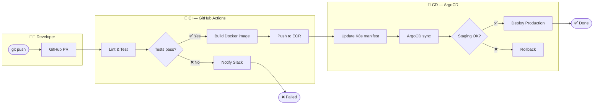

```mermaid
flowchart LR
  subgraph Dev["👨‍💻 Developer"]
    A([git push]) --> B[GitHub PR]
  end

  subgraph CI["🔁 CI — GitHub Actions"]
    C[Lint & Test] --> D{Tests pass?}
    D -- ✅ Yes --> E[Build Docker image]
    D -- ❌ No --> F[Notify Slack]
    E --> G[Push to ECR]
  end

  subgraph CD["🚀 CD — ArgoCD"]
    H[Update K8s manifest] --> I[ArgoCD sync]
    I --> J{Staging OK?}
    J -- ✅ --> K[Deploy Production]
    J -- ❌ --> L[Rollback]
  end

  B --> C
  G --> H
  K --> M([✅ Done])
  F --> N([❌ Failed])
```

